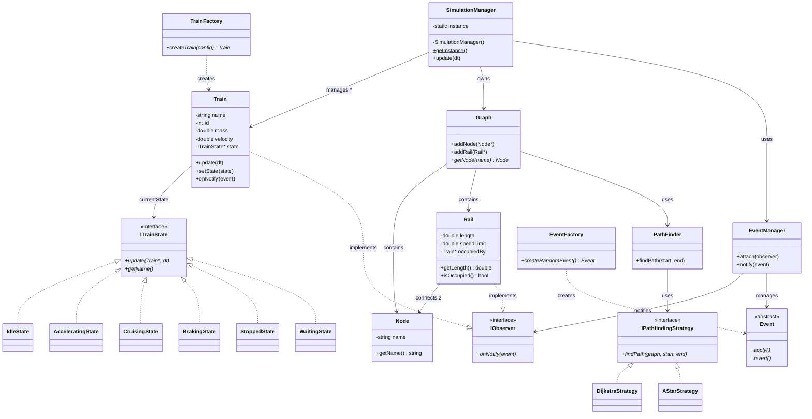
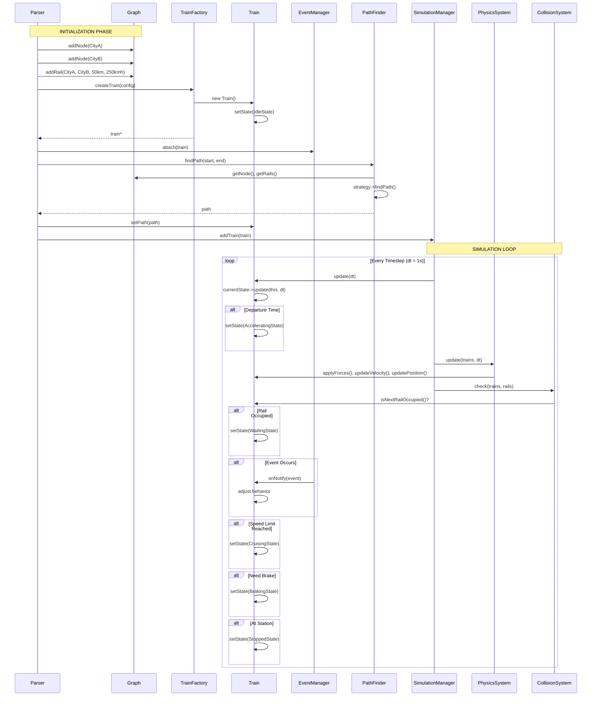
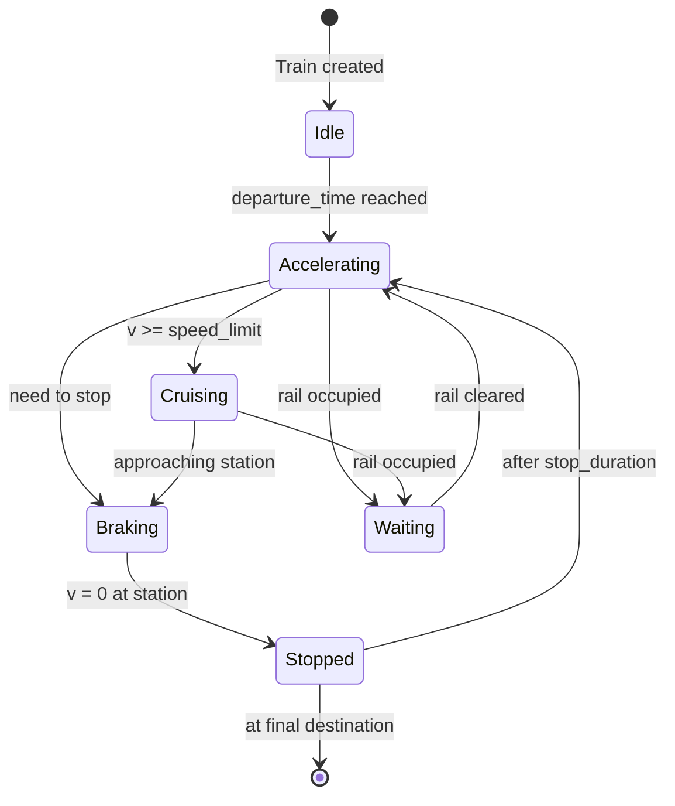

# 🎨 UML DIAGRAMS
*3 Essential Diagrams - Clean & Complete*

---

## 1. CLASS DIAGRAM - COMPLETE ARCHITECTURE

**Shows:** All 6 patterns + core entities in one organized view

**Key Points:**
- **6 Patterns Visible:** State, Strategy, Observer, Factory, Singleton (+ Command in bonus)
- **Core Entities:** Graph, Node, Rail, Train
- **SOLID Principles:** All dependencies point to interfaces (ITrainState, IPathfindingStrategy, IObserver)

### Domain Modeling Notes

- Rails are represented as bidirectional edges with exclusive occupancy.
- Node roles (City vs Junction) are represented via NodeType enum.
- Train IDs are deterministic and sequential for reproducibility.

---

## 2. SEQUENCE DIAGRAM - TRAIN JOURNEY (Runtime Behavior)

**Shows:** How objects interact over time - from creation to simulation

**Key Flow:**
1. **Creation:** Factory creates train with validation
2. **Registration:** Train registers as event observer
3. **Planning:** PathFinder calculates route (Strategy pattern)
4. **Simulation:** Loop updates train, states transition automatically

---

## 3. STATE MACHINE DIAGRAM - TRAIN BEHAVIOR

**Shows:** All possible train states and transitions

**State Descriptions:**

| State | What It Does | Physics Applied |
|-------|--------------|-----------------|
| **Idle** | Waiting at departure station | v = 0 |
| **Accelerating** | Speeding up to limit | Apply max_accel_force |
| **Cruising** | Maintaining speed limit | Balance friction |
| **Braking** | Slowing down to stop | Apply max_brake_force |
| **Stopped** | At station, passengers boarding | v = 0, wait stop_duration |
| **Waiting** | Blocked by another train | Gentle brake, wait |

**Why State Pattern:**
- ✅ No giant `if/else` in Train.update()
- ✅ Each state = separate class with own logic
- ✅ Easy to add new states (EmergencyState, MaintenanceState)

---

## EVALUATION GUIDE

### What Each Diagram Proves:

**Diagram 1 (Class):**
- ✅ "I understand OOP structure"
- ✅ "I use 6 design patterns"
- ✅ "I follow SOLID principles (interfaces everywhere)"

**Diagram 2 (Sequence):**
- ✅ "I understand runtime behavior"
- ✅ "My objects interact correctly"
- ✅ "Patterns work together in practice"

**Diagram 3 (State Machine):**
- ✅ "I model complex behavior properly"
- ✅ "State pattern solves real problem"
- ✅ "No spaghetti code in my train logic"

### Defense Questions & Answers:

**Q: "Show me the Factory pattern"**
- Point to TrainFactory → Train in Diagram 1
- "Creates trains with validation, assigns unique ID"

**Q: "Show me the State pattern"**
- Point to ITrainState hierarchy in Diagram 1
- Point to full state machine in Diagram 3
- "6 states, each handles own update logic"

**Q: "Show me the Observer pattern"**
- Point to EventManager → IObserver in Diagram 1
- Point to event notification in Diagram 2
- "EventManager notifies all trains/rails of events"

**Q: "Show me the Strategy pattern"**
- Point to PathFinder → IPathfindingStrategy in Diagram 1
- "Can swap Dijkstra/A* without changing code"

**Q: "Show me the Singleton pattern"**
- Point to SimulationManager in Diagram 1
- "One instance manages entire simulation"

**Q: "How do these patterns work together?"**
- Walk through Diagram 2 sequence
- "Factory creates → Observer registers → Strategy finds path → State controls behavior"

**Q: "Explain this relationship [points to arrow]"**
- Solid arrow = "has-a" (composition/aggregation)
- Dashed arrow = "creates" or "implements"
- Triangle = inheritance/interface implementation

**Q: "Why interface instead of concrete class?"**
- "Dependency Inversion - depend on abstractions"
- "Open/Closed - can add new implementations"
- "Easy to test with mocks"

---

## CHECKLIST

### Required for Evaluation:
- [x] **2+ UML diagrams** (we have 3)
- [x] **Class diagram** showing structure
- [x] **Behavioral diagram** showing runtime (sequence or state machine)

### Design Patterns Visible:
- [x] Factory Pattern (TrainFactory, EventFactory)
- [x] Observer Pattern (EventManager, IObserver)
- [x] Strategy Pattern (IPathfindingStrategy)
- [x] State Pattern (ITrainState + 6 states)
- [x] Singleton Pattern (SimulationManager)
- [x] Command Pattern (mentioned for bonus)

### SOLID Principles Visible:
- [x] **Single Responsibility** - Each state/strategy is separate class
- [x] **Open/Closed** - Interfaces allow extension without modification
- [x] **Liskov Substitution** - All states/strategies interchangeable
- [x] **Interface Segregation** - Lean interfaces (IObserver, ITrainState)
- [x] **Dependency Inversion** - Train depends on ITrainState, not concrete states

**Ready for defense!** 🎯
